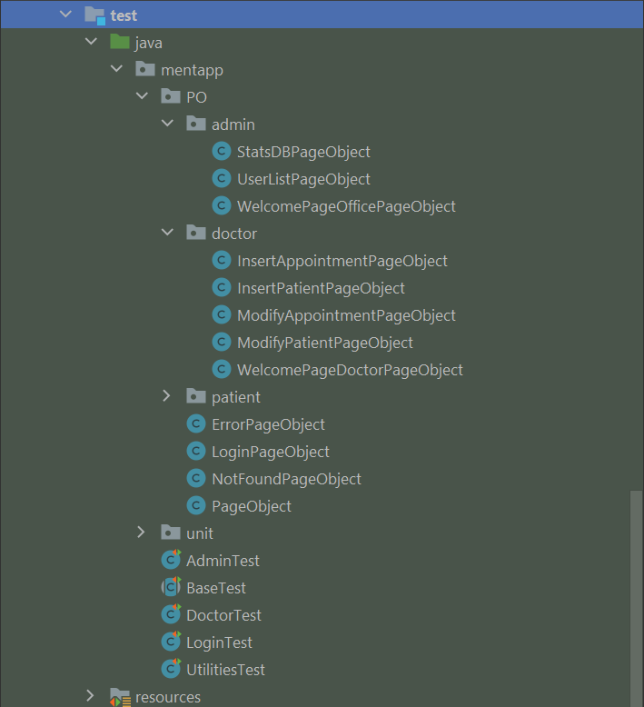
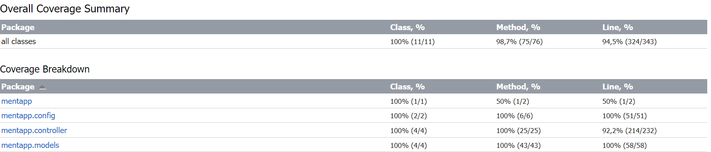

# Fondamenti di Ingegneria del Software
## Progetto finale a.a. 2022 / 2023

### Indice

- [Sviluppo del progetto](#sviluppo-del-progetto)
- [Requisiti](#requisiti)
- [Funzionamento](#funzionamento)
- [Scenari](#scenari)
    -  1 [Login](#1-login)
    -  2 [Dashboard dottore](#2-dashboard-dottore)
    -  3 [Inserisci paziente](#3-inserisci-paziente)
    -  4 [Modifica paziente](#4-modifica-paziente)
    -  5 [Elimina paziente](#5-elimina-paziente)
    -  6 [Inserisci appuntamento](#6-inserisci-appuntamento)
    -  7 [Modifica appuntamento](#7-modifica-appuntamento)
    -  8 [Elimina appuntamento](#8-elimina-appuntamento)
    -  9 [Statistiche DB](#9-statistiche-db)
- [Quality Assurance](#quality-assurance)
    - [Code coverage](#code-coverage)
- [Autori](#autori)

## Sviluppo del progetto
Il progetto è stato sviluppato con:
- Linguaggio di sviluppo: Java
- IDE: IntelliJ
- Pattern architetturale: Spring-MVC con Spring-boot
- Supporto alle dipendenze: Gradle 6.3
- Test: junit e selenium (con l'utilizzo dei ***chromedriver v109***)
- Database: h2
- Gestione file: Github

La linea adottata per il processo di sviluppo ha avuto una stretta correlazione con la metodologia agile, seppur inizialmente l'approccio è stato plan-driven, per potere avere una visione globale sull'applicativo da realizzare. Si è poi proseguito applicando in primis una divisione del carico di lavoro in task tra i vari componenti, in maniera equa. Il periodo di sviluppo stimato era di due settimane e giornalmente venivano assegnate una serie di task da completare. Nel caso in cui una task non fosse completata all'interno della giornata prefissata, essa veniva spostata al giorno successivo e discussa all'interno del meeting giornaliero per analizzare le difficoltà incontrate e trovare una soluzione coinvolgendo il gruppo.

L'avanzamento e il coordinamento dei componenti del team è stato monitorato con corti meeting giornalieri (scrum) nei quali avveniva l'allineamento relativo al codice prodotto. Lo sviluppo vero e proprio avveniva durante la giornata, con tutti i membri del team in coordinamento attraverso l'applicazione di comunicazione "Discord".

## Requisiti
Mentcare è un sistema informativo per la gestione di informazioni di pazienti e di appuntamenti presso una struttura medica. L' accesso a tale struttura è ammesso a tre utenti principali: pazienti, medici e admin.

Il sistema necessita dell'implementazione delle seguenti funzionalità:

-   memorizzare le informazioni relative ai pazienti e la loro visualizzazione
-   registrare le informazioni relative agli appuntamenti di un dottore e la loro visualizzazione
-   permettere agli utenti di accedere a queste informazioni, in base alla tipologia di utente e al suo ruolo

Gli utenti di tale sistema sono:

-   Paziente: il paziente può visualizzare le informazioni relative al proprio profilo e visualizzare i propri appuntamenti;
-   Admin: amministratore del sistema che può visualizzare le informazioni sugli utenti che possono accedere al sistema; ha inoltre accesso ad una serie di statistiche relative al database del sistema.
-   Doctor: ovvero i dottori possono gestire le informazioni dei pazienti e anche di gestire il lato relativo agli appuntamenti;

#### Vincoli strutturali
- tutti gli utenti del sistema devono autenticarsi con username e password per accedere alle funzionalità a loro riservate. In particolare:
  - I pazienti necessitano di effettuare il login per visualizzare il loro profilo e i loro appuntamenti fissati;
  - I dottori necessitano di effettuare il login per gestire i loro appuntamenti e i loro pazienti
  - L'admin necessita di effettuare il login per monitorare le statistiche e gli utenti del sistema.
- un dottore ha accesso alle sole informazioni relative ai pazienti a lui assegnati
- un paziente può essere assegnato ad un solo medico
- un appuntamento è associato ad uno ed un solo paziente
- gli appuntamenti devono essere fissati all'interno dell'orario di apertura della struttura medica. Dottori e pazienti non devono avere appuntamenti che si sovrappongono durante la giornata, considerando come slot di tempo un'ora.

## Funzionamento
Per utilizzare il sistema Mentcare è necessario accedere con le proprie credenziali che supponiamo siano già in possesso degli utenti a cui è permesso l'accesso al sistema. Nella demo fornita, è possibile autenticarsi come paziente, dottore o admin. Si rimanda alla documentazione fornita in seguito per una spiegazione dettagliata delle funzionalità accessibili a tali utenti.

In particolare, suggeriamo di utilizzare la demo fornita con queste credenziali:

|Username  |Password  |Ruolo|
|--|--|--|
| mariorossi |mario |Paziente|
| glucaverdi |gluca |Paziente|
| lucaciano |luca |Dottore|
|admin|admin|Admin|

Sono già presenti una serie di appuntamenti associati ai pazienti sopracitati per poter testare le funzionalità dell'applicativo.

#### Paziente
Se si effettua l'accesso come paziente, sarà possibile visualizzare il profilo di tale paziente e la sua lista appuntamenti.

#### Dottore
Se si effettua l'accesso come dottore sarà possibile visualizzare la dashboard di tale dottore in cui sono presenti gli appuntamenti fissati e i suoi pazienti in cura. Il dottore potrà poi effettuare azioni su pazienti o appuntamenti, tra cui eventuali inserimenti, modifiche o cancellazioni.
I campi che vanno inseriti per un nuovo paziente sono: Nome, Cognome, Data di nascita. Il focus è stato posto sugli appuntamenti, dove viene controllata ogni eventuale sovrapposizione o anomalia che potrebbe essere causata dall'inserimento o dalla modifica di un appuntamento. Le linee guida adottate comprendono slot per appuntamenti di un'ora cadauno e in un range di orario tra le 8 e le 18, orario di apertura della struttura medica.
I campi che vanno inseriti per l'aggiunta di un nuovo appuntamento sono: Data e ora, nominativo del paziente, descrizione della visita.

La cancellazione di un paziente dalla lista pazienti implica anche l'eliminazione dei suoi dati relativi agli appuntamenti fissati e alle generalità fornite.

#### Admin

L'amministratore ha un ruolo di supervisione del sistema. Una volta effettuato il login come admin, sarà possibile accedere alle statistiche del database del sistema e alla lista utenti che ha accesso a tale sistema.

Come concordato con gli stakeholders, gli utenti pazienti e admin hanno un approccio al sistema solamente di accesso e di visualizzazione delle informazioni a cui possono accedere. Gli scenari concordati ed implementati hanno il focus di rendere operativa la struttura medica, permettendo ai pazienti di essere visitati e quindi di poter avere appuntamenti. Eventuali nuove funzionalità sono da concordare con gli stakeholders e disponibili in future release.
Esponiamo ora gli scenari concordati e la loro descrizione.

## SCENARI
Per soddisfare i requisiti specificati sopra, sono stati sviluppati 9 scenari:
### 1. LOGIN
|                        | Descrizione caso                                                                                                                      |
|------------------------|---------------------------------------------------------------------------------------------------------------------------------------|
| **Prerequisiti**       | L'utente si connette al sito.                                                                                                         |
| **Funzioni**           | L'utente può inserire username e password nell'apposita form per loggarsi all'applicativo.                                            |
| **Stato finale**       | Una volta inserite le credenziali corrette, l'utente avrà accesso all'applicazione e visualizzerà la dashboard relativa al suo ruolo. | 
| **Altre funzionalità** | -                                                                                                                                     | 
| **Possibili errori**   | L'utente inserisce delle credenziali errate. Verrà reinderizzato a una pagina di errore con la possibilità di riprovare a loggarsi.   |

### 2. DASHBOARD DOTTORE
|                        | Descrizione caso                                                                                                                                                                                                                                                                                                                                                                                                                                                       |
|------------------------|------------------------------------------------------------------------------------------------------------------------------------------------------------------------------------------------------------------------------------------------------------------------------------------------------------------------------------------------------------------------------------------------------------------------------------------------------------------------|
| **Prerequisiti**       | L’utente deve essersi autenticato come dottore.                                                                                                                                                                                                                                                                                                                                                                                                                        |  
| **Funzioni**           | Il dottore ha una panoramica dei suoi appuntamenti e dei suoi pazienti, rappresentati in due liste separate. Il dottore può inserire un nuovo appuntamento tramite il pulsante "Insert Appointment" oppure modificare o eliminare un appuntamento esistente tramite i pulsanti "modify" e "delete". Situazione analoga per il paziente, dove è possibile inserirne uno nuovo tramite il pulsante "Insert Patient" oppure modificare o eliminare un paziente esistente. |
| **Stato finale**       | Il dottore visualizza la sua dashboard.                                                                                                                                                                                                                                                                                                                                                                                                                                |
| **Altre funzionalità** | Il dottore può effettuare il logout e tornare alla pagina iniziale di login.                                                                                                                                                                                                                                                                                                                                                                                           |
| **Possibili errori**   | -                                                                                                                                                                                                                                                                                                                                                                                                                                                                      |

### 3. INSERISCI PAZIENTE
|                        | Descrizione caso                                                                                                                                                                                                                                                                                                                         |
|------------------------|------------------------------------------------------------------------------------------------------------------------------------------------------------------------------------------------------------------------------------------------------------------------------------------------------------------------------------------|
| **Prerequisiti**       | L'utente è loggato come dottore ed ha cliccato il pulsante "Insert Patient" nella dashboard principale.                                                                                                                                                                                                                                  |
| **Funzioni**           | Il dottore inserisce nel form i vari dati relativi al paziente: nome, cognome e data di nascita. Una volta compilati tutti i campi, tramite il pulsante "Insert" verrà inserito il nuovo paziente all'interno della lista dei pazienti del dottore loggato e sarà visualizzabile sulla propria dashboard nella sezione "lista pazienti". | 
| **Stato finale**       | Il dottore verrà reinderizzato sulla sua dashboard e potrà verificare l'effettivo inserimento del paziente nella sezione "patients list".                                                                                                                                                                                                |
| **Altre funzionalità** | Il dottore può tornare alla sua dashboard e annullare l'inserimento del paziente tramite il pulsante "show the list".                                                                                                                                                                                                                    | 
| **Possibili errori**   | Il dottore non compila tutti i campi oppure inserisce una data di nascita futura.                                                                                                                                                                                                                                                        |

### 4. MODIFICA PAZIENTE
|                        | Descrizione caso                                                                                                                                                                                                                                                                    |
|------------------------|-------------------------------------------------------------------------------------------------------------------------------------------------------------------------------------------------------------------------------------------------------------------------------------|
| **Prerequisiti**       | L'utente è loggato come dottore ed ha cliccato il pulsante "modify" di un paziente nella sezione "patients list" nella dashboard principale.                                                                                                                                        |
| **Funzioni**           | Il dottore modifica nel form i vari dati relativi al paziente: nome, cognome e data di nascita, precompilati con le informazioni relative a quel paziente. Una volta effettuate le modifiche, clicca su "submit" e il paziente verrà aggiornato con le nuove informazioni inserite. |  
| **Stato finale**       | Viene visualizzata nuovamente la dashboard del dottore, con le modifiche effettuate al paziente scelto.                                                                                                                                                                             |
| **Altre funzionalità** | Se l’utente clicca su “Show the list”, le modifiche non vengono confermate, il database non viene aggiornato e l'utente ritorna alla dashboard.                                                                                                                                     |
| **Possibili errori**   | Il dottore inserisce una data di nascita futura o lascia vuoto un campo.                                                                                                                                                                                                            |

###  5.  ELIMINA PAZIENTE
|                              | Descrizione                                                                                                                                                                                                                |
|------------------------------|----------------------------------------------------------------------------------------------------------------------------------------------------------------------------------------------------------------------------|
| **Prerequisiti**             | L'utente deve essersi autenticato come dottore.                                                                                                                                                                            |
| **Funzionamento**            | L'utente preme il tasto "delete" in corrispondenza del paziente che vuole eliminare. Tale paziente verrà eliminato.                                                                                                        |
| **Stato finale del sistema** | Viene visualizzata nuovamente la dashboard del dottore con l'elenco dei pazienti, escluso quello appena rimosso. Si nota inoltre che dalla lista appuntamenti, sono stati eliminati gli appuntamenti del paziente rimosso. |
| **Altre funzionalità**       | -                                                                                                                                                                                                                          |
| **Possibili errori**         | -                                                                                                                                                                                                                          |

### 6. INSERISCI APPUNTAMENTO
|                              | Descrizione                                                                                                                                                                                                                                                                                                                                                                                                                                                                                                                                                      |
|------------------------------|------------------------------------------------------------------------------------------------------------------------------------------------------------------------------------------------------------------------------------------------------------------------------------------------------------------------------------------------------------------------------------------------------------------------------------------------------------------------------------------------------------------------------------------------------------------|
| **Prerequisiti**             | L'utente deve essersi autenticato come dottore.                                                                                                                                                                                                                                                                                                                                                                                                                                                                                                                  |
| **Funzionamento**            | L'utente preme il tasto "Insert appointment" e visualizza una pagina nella quale può inserire un nuovo appuntamento. Si apre una nuova pagina relativa all'inserimento di un nuovo appuntamento. Il dottore inserisce nel form i vari dati relativi all'appuntamento: data, ora, descrizione e nome del paziente. Una volta compilati tutti i campi, tramite il pulsante "Insert" verrà inserito il nuovo appuntamento all'interno della lista appuntamenti del dottore loggato e sarà visualizzabile sulla propria dashboard nella sezione "Appointments list". |
| **Stato finale del sistema** | Viene visualizzata nuovamente la dashboard del dottore con l'elenco degli appuntamenti, con il nuovo appuntamento presente nella lista appuntamenti.                                                                                                                                                                                                                                                                                                                                                                                                             |
| **Altre funzionalità**       | Se l’utente clicca su “Show the list”, anziché salvare le modifiche, il database non viene modificato e l'utente ritorna alla dashboard.                                                                                                                                                                                                                                                                                                                                                                                                                         |
| **Possibili errori**         | Se uno dei campi rimane vuoto o se è presente un'errore sulla data inserita (data nel passato, data sovrapposta ad un altro appuntamento) verrà visualizzata una pagina di errore e l’ entry non verrà modificata.                                                                                                                                                                                                                                                                                                                                               |

### 7. MODIFICA APPUNTAMENTO
|                              | Descrizione                                                                                                                                                                                                                                                                               |
|------------------------------|-------------------------------------------------------------------------------------------------------------------------------------------------------------------------------------------------------------------------------------------------------------------------------------------|
| **Prerequisiti**             | L'utente deve essersi autenticato come dottore.                                                                                                                                                                                                                                           |
| **Funzionamento**            | L'utente preme il tasto "modify" in corrispondenza dell'appuntamento che vuole modificare e visualizza una pagina nella quale può effettuare delle modifiche. Una volta effettuate le modifiche, clicca su "submit" e l'appuntamento verrà aggiornato con le nuove informazioni inserite. |
| **Stato finale del sistema** | Viene visualizzata nuovamente la dashboard del dottore, con le modifiche effettuate all'appuntamento scelto.                                                                                                                                                                              |
| **Altre funzionalità**       | Se l’utente clicca su “Show the list”, le modifiche non vengono confermate, il database non viene aggiornato e l'utente ritorna alla dashboard.                                                                                                                                           |
| **Possibili errori**         | Se uno dei campi rimane vuoto o se è presente un'errore sulla data inserita (data nel passato, data sovrapposta ad un altro appuntamento) verrà visualizzata una pagina di errore e l’ entry non verrà modificata.                                                                        |

### 8. ELIMINA APPUNTAMENTO
|                              | Descrizione                                                                                                                  |
|------------------------------|------------------------------------------------------------------------------------------------------------------------------|
| **Prerequisiti**             | L'utente deve essersi autenticato come dottore.                                                                              |
| **Funzionamento**            | L'utente preme il tasto "delete" in corrispondenza dell'appuntamento che vuole eliminare. Tale appuntamento verrà eliminato. |
| **Stato finale del sistema** | Viene visualizzata nuovamente la dashboard del dottore con l'elenco degli appuntamenti, escluso quello appena rimosso.       |
| **Altre funzionalità**       | -                                                                                                                            |
| **Possibili errori**         | -                                                                                                                            |

### 9. STATISTICHE DB
|                              | Descrizione                                                                                                             |
|------------------------------|-------------------------------------------------------------------------------------------------------------------------|
| **Prerequisiti**             | L'utente deve essersi autenticato come admin.                                                                           |
| **Funzionamento**            | L'utente preme il pulsante "statsDB" e viene visualizzata la pagina che mostra l'elenco delle statistiche del database. |
| **Stato finale del sistema** | -                                                                                                                       |
| **Altre funzionalità**       | -                                                                                                                       |
| **Possibili errori**         | -                                                                                                                       |

## Quality assurance
Per garantire un adeguato livello di qualità sono stati predisposti e realizzati una serie di test automatizzati con JUnit e test end to end con Selenium. Giornalmente sono state effettuate attività come il refactoring per sistemare e pulire i file che erano oggetto di lavoro da parte di tutti i membri del gruppo. Sono quindi state adottate una serie di operazioni (pulizia del codice, eliminazione metodi ridondanti, ridenominazione di classi e variabili) per garantire un certo livello di qualità. Degno di nota è stato lo strumento per il refactoring automatico di IntelliJ che ci ha permesso di risparmiare notevole tempo in quanto permette di aggiornare il codice automaticamente in seguito al cambiamento di un nome di una classe, per esempio.

I test sono suddivisi all'interno del package test/java/mentapp nel seguente modo:
- package PO: contiene i file relativi ai test end to end con Selenium con una suddivisione per distinguere i file appartenenti ad una determinata categoria di user.
- package unit: contiene i test di unità che mirano a testare le funzionalità principali del sistema, come l'inserimento di pazienti e appuntamenti.

All'interno del package mentapp sono inoltre presenti i file relativi ai test eseguiti:
- AdminTest: implementa lo scenario di test relativo all'utente admin, attraverso test end to end.
- BaseTest: inizializza le risorse prima dell'avvio dei test e successivamente procede con una deallocazione di quest'ultime, attuando anche un reset al database. Tale azione permette di poter eseguire i test sia in modo collettivo sia singolarmente.
- DoctorTest: implementa gli scenari relativi al dottore, attraverso test end to end.
- LoginTest: implementa lo scenario relativo al login, attraverso test end to end **su ogni tipologia di utente** che ha accesso al sistema.
- UtilitiesTest: file aggiuntivo che implementa test su funzionalità quali profilo paziente, lista appuntamenti paziente e lista utenti amministratore, che non sono stati oggetto di scenari concordati ma sono comunque funzionalità implementate atte a supportare gli scenari concordati.

### Code coverage
Per verificare la coverage del progetto abbiamo utilizzato lo strumento automatizzato IntelliJ Coverage con l'obiettivo di raggiungere una coverage generale del 90%. Da parte dei membri del gruppo è stato svolto un ulteriore lavoro minuzioso nella ricerca di ampliare tutti i test effettuati che ha permesso di raggiungere una coverage tendente al 100%. Il report generato è riportato di seguito:

## Autori
- Diego Garofolo: VR473579
- Matteo Robol: VR480952
- Enrico Zaghi: VR490441
